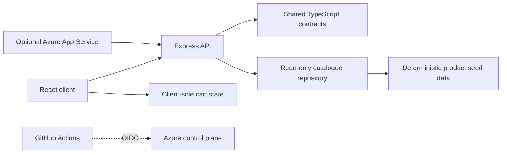

# Repository design

## Purpose

This repository is a deployable Babazon.com starter and a teaching harness for
an issue-first Agentic SDLC workshop. It optimizes for participant success in a
four-hour session while demonstrating production-oriented engineering controls.

Babazon.com is fictional and uses an original, simple visual identity. It must
not copy Amazon branding, assets, page designs, text, or trade dress.

## Design principles

### The repository and GitHub are the system of record

Durable architecture, operational instructions, validation commands, issues,
pull requests, and CI evidence are versioned or linked from the repository.
Agent conversation history is not authoritative.

### Planning is lightweight and issue-first

Material work follows this contract:

```text
parent issue -> reviewed Copilot App Plan -> bounded child issues
             -> isolated sessions/worktrees -> pull requests
             -> deterministic CI and review -> optional deployment evidence
```

The parent issue contains the user outcome and observable acceptance criteria.
Exactly four child issues record dependencies plus owned and prohibited paths.
The reviewed Plan resolves shared foundations before parallel implementation.

### Context uses progressive disclosure

```text
AGENTS.md                  repository map and universal guardrails
DESIGN.md                  durable architecture and boundaries
docs/                      workshop and operational documentation
GitHub issues              outcome, acceptance criteria, tasks, ownership
<directory>/AGENTS.md      local rules and validation
```

### Constraints are executable

Important rules are enforced by tests, linters, workflow permissions, policy,
or structural checks. Documentation explains the rule; automation proves it.

### Humans approve intent and risk

Agents may explore, plan, implement, test, and prepare pull requests. Humans
approve the Plan, architectural and security trade-offs, merge, and deployment.

## Application architecture

Babazon.com is a TypeScript system with a React client and Express API. Express
serves both the API and production React bundle from one process.



Dependency direction is inward. UI and transport layers use shared contracts;
the API depends on the catalogue interface; seed data implements that
interface. Shared contracts do not depend on React, Express, or Azure SDKs.

## Bounded commerce domain

The starter supports:

- deterministic product catalogue and seed data;
- product search and category filtering;
- product details required by the UI;
- client-side cart additions, removals, and quantity changes;
- calculated item counts and subtotal;
- simulated checkout confirmation;
- accessible loading, empty, validation, success, and failure states;
- `/health` liveness and catalogue-backed `/ready` readiness.

Non-goals are authentication, customer accounts, real payments, external
inventory/shipping/tax services, durable orders, and production commerce.
Money is represented as integer minor units and formatted at the UI boundary.

## Repository boundaries

| Area | Responsibility |
|---|---|
| `src/shared/` | Framework-independent contracts and deterministic catalogue data |
| `src/server/` | Express transport, catalogue boundary, logging, and operations |
| `src/client/` | Accessible product discovery, cart, and simulated checkout |
| `tests/` | Unit, API, structural, and Playwright verification |
| `docs/labs/` | Five participant labs and the workshop wrap-up |
| `.github/` | CI, security, deployment, Copilot, issues, and review templates |
| `infra/` | Optional generic Azure App Service and monitoring composition |

## Delivery gates and evidence

| Workflow | Responsibility |
|---|---|
| `ci.yml` | Lint, type-check, unit/API/UI tests, build, browser QA, and smoke checks |
| `codeql.yml` | Code scanning where visibility and licensing permit |
| `dependency-review.yml` | Dependency change review where available |
| `infra-validate.yml` | Bicep validation and Azure what-if through OIDC |
| `deploy.yml` | Optional protected deployment and live catalogue verification |

Workflows default to read-only permissions. Azure authentication uses GitHub
OIDC and protected environments. Licensed or preview controls must be reported
as unavailable rather than represented as equivalent local checks.

## Workshop constraints

- The four-hour participant path uses the GitHub Copilot App as the primary
  interface.
- Product search and category filtering are the shared feature path.
- Fleet is used only after shared foundations and non-overlapping ownership are
  reviewed.
- Focused tests should return actionable results within two minutes.
- Every lab has a happy path, recovery checkpoint, and optional stretch task.
- Azure deployment remains advanced/instructor material and is not required to
  complete the participant path.

## Final workshop outcome

Each team leaves a GitHub-visible chain from a parent Babazon outcome issue,
through a reviewed Plan and bounded task issues, to pull requests with
deterministic CI and review evidence. Optional advanced work may add a protected
Azure deployment and evidence review, but local application and browser QA
completion does not depend on cloud access.
